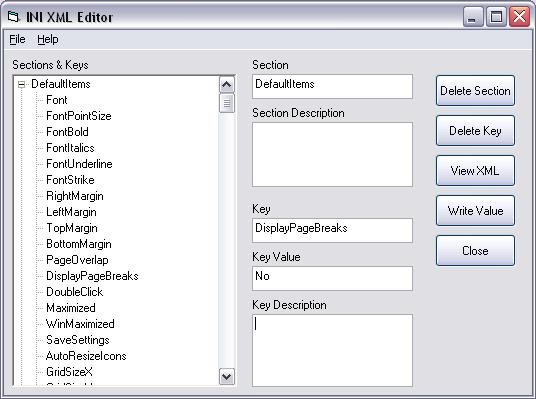

<div align="center">

## INI to XML Class and Edit utility


</div>

### Description

I have seen several INI to XML conversion submissions on PSC, but they all seemed to lack some functionality, so I decided to write this. With this class you can convert INI files to compatible XML files and a create a new file. You can also create, delete and edit sections and keys as you wish. I think the editor is pretty easy to use, but have included a Word document that describes how to perform certain tasks. Please let me know what you think, bugs found, or any ideas for improvement.
 
### More Info
 


<span>             |<span>
---                |---
**Submitted On**   |2006-12-22 10:39:48
**By**             |[james kahl](https://github.com/Planet-Source-Code/PSCIndex/blob/master/ByAuthor/james-kahl.md)
**Level**          |Intermediate
**User Rating**    |5.0 (15 globes from 3 users)
**Compatibility**  |VB 5\.0, VB 6\.0
**Category**       |[Files/ File Controls/ Input/ Output](https://github.com/Planet-Source-Code/PSCIndex/blob/master/ByCategory/files-file-controls-input-output__1-3.md)
**World**          |[Visual Basic](https://github.com/Planet-Source-Code/PSCIndex/blob/master/ByWorld/visual-basic.md)
**Archive File**   |[INI\_to\_XML20388912222006\.zip](https://github.com/Planet-Source-Code/james-kahl-ini-to-xml-class-and-edit-utility__1-67441/archive/master.zip)

### API Declarations

```
ShellExecute
GetPrivateProfileSection
GetPrivateProfileSectionNames
```


